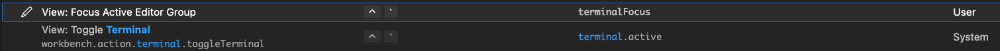

# VS Code Shortcuts

### General:

|Operation|Command|
|---|---|
|open command palette|CMD + SHIFT + P|
|open file finder|CMD + P|

### Editing:

|Operation|Command|
|---|---|
|delete line|SHIFT + CMD + K **OR** CMD + BACKSPACE|
|move line down / up|OPT + DOWN / UP|
|move cursor to start or end of line|CMD + RIGHT / LEFT|
|add comment|CMD + /|
|delete character on left / right|CTRL + H / D|
|add cursor | OPT + CLICK|

### Navigation:

|Operation|Command|
|---|---|
|switch between tabs|CMD + OPTION + ARROW|
|switch to last tab|CTRL + TAB|
|search extensions and files | CMD + P |
|open command palette|CMD + SHIFT + P|
|search all project|CMD + SHIFT + F|

### Custom Shortcuts:

|Operation|Command|
|---|---|
| close activity bar | OPT + CMD + A | 
| toggle sidebar | CMD + B | 
| switch from editor to terminal |CTRL + \` |

---------------

### Kill Server Port Command:   
`lsof -P -i :<port number>`

then... 

`kill -9 <PID>`

kdjsljfd dfsfsd